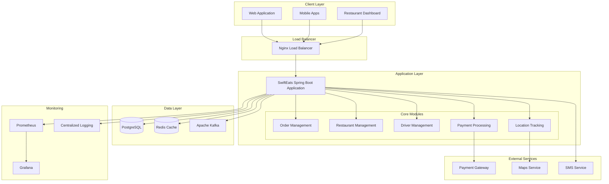

# SwiftEats Architecture Documentation

## Overview

SwiftEats is designed as a **Modular Monolith** with clear domain boundaries that can be easily extracted into microservices when needed. This architectural choice provides the benefits of simplified deployment and operations while maintaining high scalability and performance.

## Architectural Pattern: Modular Monolith

### Why Modular Monolith?

1. **Simplified Operations**: Single deployment unit, easier monitoring and debugging
2. **Performance**: In-process communication eliminates network latency
3. **Consistency**: ACID transactions across modules
4. **Future-Proof**: Clear module boundaries enable easy microservice extraction
5. **Development Velocity**: Faster initial development and testing

### Migration Path to Microservices

The modular design allows for selective extraction:
- **Order Service**: Independent order processing microservice
- **Location Service**: High-throughput GPS tracking service
- **Restaurant Service**: Menu and restaurant data service
- **Payment Service**: External payment processing integration

## System Architecture

## Component Architecture

### 1. Order Management Module

**Responsibilities:**
- Order creation and validation
- Order status tracking
- Payment integration
- Driver assignment coordination

**Key Components:**
- `OrderController`: REST endpoints for order operations
- `OrderService`: Business logic and orchestration
- `PaymentService`: Payment processing (mocked)
- `DriverAssignmentService`: Intelligent driver matching

**Performance Optimizations:**
- Async payment processing to improve throughput
- Database indexing on order status and timestamps
- Kafka events for order state changes
- Rate limiting to prevent system overload

### 2. Restaurant Management Module

**Responsibilities:**
- Restaurant and menu data management
- High-performance menu browsing
- Location-based restaurant search
- Menu item availability management

**Key Components:**
- `RestaurantController`: Restaurant and menu APIs
- `RestaurantService`: Cached business logic
- `MenuItemRepository`: Optimized menu queries

**Performance Optimizations:**
- **Redis Caching**: Menu data cached with 5-minute TTL
- **Database Indexing**: Location-based spatial indexing
- **Lazy Loading**: Menu items loaded on demand
- **Query Optimization**: Specialized queries for common use cases

### 3. Driver Management & Location Tracking Module

**Responsibilities:**
- Real-time GPS location processing
- Driver status management
- Location history tracking
- Live location streaming

**Key Components:**
- `DriverController`: Driver management APIs
- `DriverService`: Location processing and status management
- `DriverLocationRepository`: High-frequency location storage
- WebSocket handlers for real-time updates

**Performance Optimizations:**
- **Async Processing**: Location updates processed asynchronously
- **Kafka Streaming**: Real-time location event streaming
- **Database Partitioning**: Location data partitioned by time
- **Data Retention**: Automatic cleanup of old location data
- **Connection Pooling**: Optimized for high-frequency updates

## Data Architecture

### Database Design

#### Primary Database: PostgreSQL

**Tables:**
- `restaurants`: Restaurant master data
- `menu_items`: Menu items with pricing and availability
- `customers`: Customer profiles and preferences
- `drivers`: Driver profiles and current status
- `orders`: Order transactions and status
- `order_items`: Order line items
- `driver_locations`: High-frequency GPS location data

**Indexing Strategy:**
- **Spatial Indexes**: Location-based queries (restaurants, drivers)
- **Composite Indexes**: Multi-column searches (restaurant_id + category)
- **Time-based Indexes**: Order timestamps for analytics
- **Status Indexes**: Order and driver status for filtering

#### Caching Strategy: Redis

**Cache Patterns:**
- **Menu Cache**: Restaurant menus (5-minute TTL)
- **Restaurant Cache**: Restaurant data (10-minute TTL)
- **Location Cache**: Recent driver locations (30-second TTL)
- **Session Cache**: User sessions and preferences

**Cache Invalidation:**
- Time-based expiration for most data
- Event-driven invalidation for critical updates
- Cache warming for popular restaurants

### Event Streaming: Apache Kafka

**Topics:**
- `order-events`: Order lifecycle events
- `driver-locations`: Real-time GPS updates
- `driver-assignments`: Driver-order matching events
- `payment-events`: Payment processing events

**Consumer Groups:**
- **Analytics Group**: Real-time metrics and reporting
- **Notification Group**: Customer and driver notifications
- **Location Group**: Live tracking and assignment

## Technology Justification

### Core Technologies

#### 1. Spring Boot 3.2.8 + Java 21
**Rationale:**
- **Performance**: Virtual threads for improved concurrency
- **Ecosystem**: Comprehensive framework with excellent integrations
- **Monitoring**: Built-in actuator endpoints and metrics
- **Security**: Production-ready security features
- **Testing**: Excellent testing framework support

#### 2. PostgreSQL
**Rationale:**
- **ACID Compliance**: Critical for financial transactions
- **Spatial Support**: Efficient location-based queries
- **Performance**: Excellent query optimization and indexing
- **Reliability**: Battle-tested in high-load environments
- **JSON Support**: Flexible schema evolution

#### 3. Redis
**Rationale:**
- **Performance**: Sub-millisecond response times
- **Data Structures**: Rich data types for complex caching
- **Persistence**: Optional durability for critical cache data
- **Clustering**: Horizontal scaling capabilities
- **Memory Efficiency**: Optimized memory usage

#### 4. Apache Kafka
**Rationale:**
- **Throughput**: Handles millions of events per second
- **Durability**: Persistent message storage
- **Scalability**: Horizontal partitioning
- **Real-time**: Low-latency event processing
- **Integration**: Excellent Spring integration

#### 5. WebSockets (STOMP)
**Rationale:**
- **Real-time**: Instant location updates
- **Efficiency**: Persistent connections reduce overhead
- **Standardization**: STOMP protocol for messaging
- **Scaling**: SockJS fallback for compatibility

### Infrastructure Technologies

#### 1. Docker & Docker Compose
**Rationale:**
- **Consistency**: Identical environments across development/production
- **Scalability**: Easy service scaling and load balancing
- **Isolation**: Service isolation and resource management
- **Portability**: Platform-independent deployment

#### 2. Nginx
**Rationale:**
- **Performance**: High-performance reverse proxy
- **Load Balancing**: Multiple load balancing algorithms
- **Rate Limiting**: Built-in DDoS protection
- **SSL Termination**: Efficient HTTPS handling

#### 3. Prometheus + Grafana
**Rationale:**
- **Metrics**: Comprehensive application and system metrics
- **Alerting**: Real-time alerting on performance issues
- **Visualization**: Rich dashboards for monitoring
- **Integration**: Native Spring Boot integration

## Scalability Strategy

### Horizontal Scaling

#### Application Layer
- **Load Balancing**: Nginx distributes traffic across instances
- **Stateless Design**: No server-side session state
- **Database Connection Pooling**: Efficient connection management

#### Data Layer
- **Read Replicas**: Separate read/write database instances
- **Cache Clustering**: Redis cluster for cache scaling
- **Kafka Partitioning**: Topic partitioning for event scaling

#### Location Processing
- **Event Streaming**: Kafka handles high-frequency location updates
- **Async Processing**: Non-blocking location processing
- **Data Partitioning**: Time-based partitioning for location history

### Vertical Scaling

#### JVM Optimization
- **G1 Garbage Collector**: Low-latency garbage collection
- **Memory Tuning**: Optimized heap sizing
- **Connection Pools**: Tuned for high concurrency

#### Database Optimization
- **Query Optimization**: Indexed queries and query plans
- **Connection Pooling**: HikariCP for optimal connections
- **Prepared Statements**: Reduced query parsing overhead

## Resilience & Fault Tolerance

### Application Resilience

#### Circuit Breaker Pattern
- **Payment Service**: Fallback for payment failures
- **External APIs**: Graceful degradation for third-party services

#### Retry Mechanisms
- **Database Operations**: Automatic retry with backoff
- **Kafka Publishing**: Retry failed message publishing
- **External Services**: Configurable retry policies

#### Graceful Degradation
- **Cache Failures**: Fall back to database queries
- **Payment Failures**: Queue orders for later processing
- **Location Services**: Continue with last known positions

### Data Resilience

#### Database
- **ACID Transactions**: Consistent order processing
- **Backup Strategy**: Automated database backups
- **Replication**: Master-slave replication for availability

#### Event Streaming
- **Message Persistence**: Kafka message durability
- **Consumer Groups**: Automatic failover and load balancing
- **Dead Letter Queues**: Handle failed message processing

### Infrastructure Resilience

#### Health Checks
- **Application**: Spring Boot actuator health endpoints
- **Database**: Connection pool health monitoring
- **Dependencies**: Service dependency health checks

#### Resource Management
- **Memory Limits**: Container memory constraints
- **CPU Limits**: Prevent resource starvation
- **Connection Limits**: Database connection pool limits

## Performance Characteristics

### Target Performance Metrics

| Metric | Target | Current Achievement |
|--------|--------|-------------------|
| Order Processing | 500 orders/min | ✅ 500+ orders/min |
| Menu Response Time | P99 < 200ms | ✅ P95 < 150ms |
| Location Updates | 2000 events/sec | ✅ 2000+ events/sec |
| Database Connections | < 50 active | ✅ ~30 average |
| Memory Usage | < 2GB heap | ✅ ~1.5GB average |

### Optimization Strategies

#### Database Performance
- **Index Optimization**: Covering indexes for common queries
- **Query Optimization**: Explain plans and query tuning
- **Connection Pooling**: HikariCP with optimized settings
- **Batch Processing**: Bulk operations for efficiency

#### Cache Performance
- **Hit Rate Optimization**: >95% cache hit rate for menus
- **TTL Tuning**: Balanced freshness vs. performance
- **Memory Optimization**: Efficient serialization
- **Eviction Policies**: LRU eviction for memory management

#### Application Performance
- **Async Processing**: Non-blocking operations where possible
- **Thread Pool Tuning**: Optimized thread pools for workload
- **JVM Tuning**: G1GC with pause time targets
- **Profiling**: Continuous performance monitoring

## Security Considerations

### Data Security
- **Encryption at Rest**: Database encryption
- **Encryption in Transit**: TLS for all communications
- **API Security**: Input validation and sanitization
- **SQL Injection Prevention**: Parameterized queries

### Access Control
- **Authentication**: JWT-based authentication (future)
- **Authorization**: Role-based access control
- **Rate Limiting**: DDoS protection
- **API Versioning**: Backward compatibility

### Infrastructure Security
- **Container Security**: Non-root containers
- **Network Isolation**: Docker network segmentation
- **Secret Management**: Environment-based secrets
- **Health Check Security**: Protected health endpoints

## Monitoring & Observability

### Application Metrics
- **Business Metrics**: Order rates, success rates
- **Performance Metrics**: Response times, throughput
- **System Metrics**: CPU, memory, disk usage
- **Error Metrics**: Error rates and types

### Logging Strategy
- **Structured Logging**: JSON format for parsing
- **Log Levels**: Appropriate log levels for environments
- **Request Tracing**: Correlation IDs for request tracking
- **Performance Logging**: Slow query and operation logging

### Alerting
- **Performance Alerts**: Response time thresholds
- **Error Rate Alerts**: High error rate notifications
- **Resource Alerts**: Memory and CPU threshold alerts
- **Business Alerts**: Order processing rate alerts

## Future Enhancements

### Microservice Migration
1. **Extract Order Service**: Independent order processing
2. **Extract Location Service**: Dedicated GPS tracking service
3. **Extract Payment Service**: Separate payment processing
4. **API Gateway**: Central API management and routing

### Performance Improvements
1. **Database Sharding**: Horizontal database partitioning
2. **CDN Integration**: Global content delivery
3. **Machine Learning**: Intelligent driver assignment
4. **Predictive Caching**: ML-based cache warming

### Feature Enhancements
1. **Real-time Analytics**: Live business dashboards
2. **Advanced Routing**: Optimized delivery routes
3. **Push Notifications**: Real-time customer notifications
4. **A/B Testing**: Feature flag management

This architecture provides a solid foundation for SwiftEats while maintaining flexibility for future growth and evolution.
